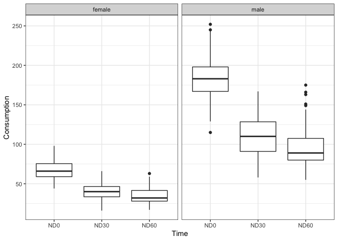

Check out the final report at <a href="https://github.com/valuntiny/LDA_final/blob/master/Final_report.pdf"> Final\_report.pdf </a>
-----------------------------------------------------------------------------------------------------------------------------------

EDA
---

    # load data
    alcohol <- readxl::read_xls("ALCDEP.xls") %>% 
      as_tibble() %>% 
      mutate(sid = as.integer(sid),
             Treatment = as.factor(Treatment),
             Gender = ifelse(Gender == 0, "male", "female"),
             Gender = factor(Gender),
             ND0 = as.integer(ND0),
             ND30 = as.integer(ND30),
             ND60 = as.integer(ND60),
             Relapse = as.factor(Relapse))

    table(alcohol$Treatment)

    ## 
    ##   1   2   3 
    ## 106 107 101

    table(alcohol$Gender)

    ## 
    ## female   male 
    ##    143    171

    table(alcohol$Relapse)

    ## 
    ##   0   1 
    ## 164 150

    # boxplot for mean and variance
    alcohol %>% 
      gather(ND0:ND60, key = "Time", value = "Consumption") %>% 
      ggplot(aes(x = Time, y = Consumption, group = Time)) +
      geom_boxplot() +
      facet_grid(. ~ Gender)

    # standardized time plot
    jpeg("spaghetti.jpg", units = "in", width = 10, height = 6, res = 300)
    alcohol2 <- sweep(alcohol[,c(4:6)], 2, apply(alcohol[,c(4:6)], 2, mean))
    sd1 <- apply(alcohol[,c(4:6)], 2, sd)
    alcohol2 <- sweep(alcohol2, 2, sd1, FUN = "/")
    alcohol2 <- cbind(alcohol[,c(1:3)], alcohol2)
    alcohol2 %>% gather(ND0:ND60, key = "Time", value = "Consumption") %>% 
      ggplot(aes(x = Time, y = Consumption, group = sid, color = Treatment)) +
      geom_line() +
      facet_grid(. ~ Gender)
    dev.off()

    ## quartz_off_screen 
    ##                 2

    # median polish
    jpeg("feature_effect.jpg", units = "in", width = 10, height = 6, res = 300)
    junk1 <- medpolish(alcohol[, c(4:6)])

    ## 1: 12256
    ## 2: 10872
    ## Final: 10872

    res <- junk1$res
    cols <- rep(1:314, rep(3, 314))
    par(mfcol = c(2, 2))
    plot(as.vector(t(res)), col = cols, pch = 19, cex = 0.8, 
         xlab = "Children", ylab = "Residuals", main = "(A)")
    plot(junk1$col ,xlab = "Time", ylab = "Time Effect", main = "(B)")
    plot(junk1$row, xlab = "Subject", ylab = "Subject Effect", main = "(C)")
    acf(as.vector(t(res)), xlab = "Lag", main = "(D)")
    dev.off()

    ## quartz_off_screen 
    ##                 2

    # GEE model regarding alcohol consumption
    alcohol3 <- alcohol %>% 
      gather(ND0:ND60, key = "Time", value = "Consumption")
    fit.gee <- gee(Consumption ~ Treatment * Time + Treatment * Gender, 
                   data = alcohol3, family = "gaussian", 
                   id = sid, corstr = "unstructured")

    ## Beginning Cgee S-function, @(#) geeformula.q 4.13 98/01/27

    ## running glm to get initial regression estimate

    ##           (Intercept)            Treatment2            Treatment3 
    ##             80.271605              5.866159              9.649037 
    ##              TimeND30              TimeND60            Gendermale 
    ##            -40.924528            -42.575472             92.619421 
    ##   Treatment2:TimeND30   Treatment3:TimeND30   Treatment2:TimeND60 
    ##             -3.888556            -30.402204            -31.246958 
    ##   Treatment3:TimeND60 Treatment2:Gendermale Treatment3:Gendermale 
    ##            -29.632449             -9.873304            -19.794593

    sum.gee <- summary(fit.gee)
    gee.coef <- sum.gee$coefficients %>% 
      as_tibble() %>% 
      mutate(parameters = rownames(sum.gee$coefficients),
             CIlow = Estimate - `Robust S.E.`,
             CIup = Estimate + `Robust S.E.`,
             CI = paste("(", round(CIlow, 3), ", ", round(CIup, 3), ")", sep = ""),
             pvalue = pnorm(`Robust z`, lower.tail = F) * 2) %>% 
      select(parameters, Estimate, `Robust S.E.`, CI, pvalue)
    gee.coef %>% write.csv("gee.coef.csv", na = "")

    sum.gee$working.correlation

    ##      [,1] [,2] [,3]
    ## [1,]    1    0    0
    ## [2,]    0    0    0
    ## [3,]    0    0    0

    # GLME model regarding relapse
    fit.glme <- glmer(Relapse ~ Treatment + (1 | sid), 
                      data = alcohol, family = "binomial")
    sum.glme <- summary(fit.glme)
    glme.coef <- sum.glme$coefficients %>% 
      as_tibble() %>% 
      mutate(parameters = rownames(sum.glme$coefficients),
             CIlow = Estimate - `Std. Error`,
             CIup = Estimate + `Std. Error`,
             CI = paste("(", round(CIlow, 3), ", ", round(CIup, 3), ")", sep = "")) %>% 
      select(parameters, Estimate, `Std. Error`, CI, `Pr(>|z|)`)
    glme.coef %>% write.csv("glme.coef.csv", na = "")

    sum.glme$varcor %>% knitr::kable()

<table>
<thead>
<tr class="header">
<th align="left">grp</th>
<th align="left">var1</th>
<th align="left">var2</th>
<th align="right">vcov</th>
<th align="right">sdcor</th>
</tr>
</thead>
<tbody>
<tr class="odd">
<td align="left">sid</td>
<td align="left">(Intercept)</td>
<td align="left">NA</td>
<td align="right">1e-07</td>
<td align="right">0.0002327</td>
</tr>
</tbody>
</table>
